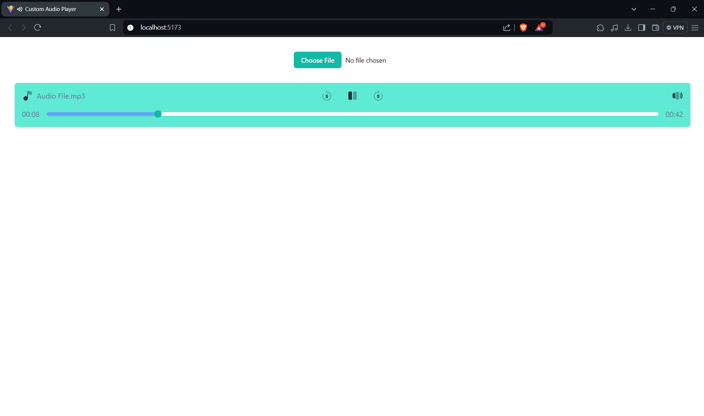

# Custom Audio Player

A simple audio player built with React to showcase DOM manipulation techniques.

## Features

- Play and pause audio
- Adjust volume
- Display current playback time
- Simple and clean UI design

## Running the app

Clone the repository

```
git clone https://github.com/withmohitjoshi/audio-player.git
```

Navigate to the directory

```
cd ./audio-player
```

Install dependencies:

```
npm install
```

Start the development server

```
npm dev
```

## Snapshot


